# DMC 2016 Virtual Machine

This process automates the installation of a full Machine Learning (ML) software stack running on Linux Ubuntu 14.04.

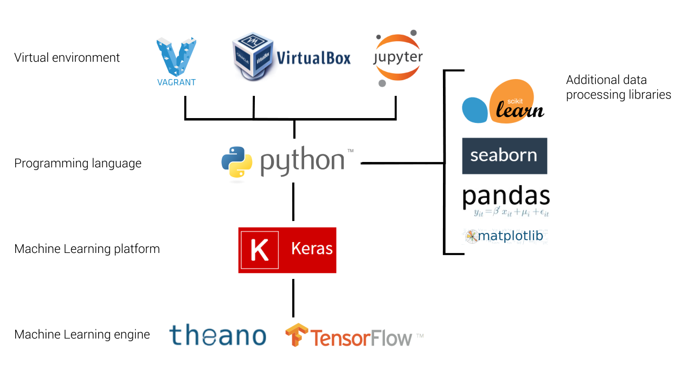

What's included:
* [Keras](http://keras.io/) - minimalist, highly modular neural networks (NN) library.
* [Theano](http://deeplearning.net/software/theano/) - library to define, optimize, and evaluate mathematical expressions involving multi-dimensional arrays efficiently.
* [Tensorflow](https://www.tensorflow.org/versions/r0.7/api_docs/index.html) - library for numerical computation using data flow graphs.
* [Scikit-learn](http://scikit-learn.org/) - a basic library for many ML algorithms beyond NN.
* [Jupyter](http://jupyter.readthedocs.org/en/latest/index.html) - web application to create, share documents that contain live code, equations, visualizations and explanatory text.

# What is this for?

Going through the following process will set up a virtual Linux environment on your computer, and use Vagrant to automatically set it up with all the tools we will use in class. The goal of this process is to create an easily reproduceable programming environment which gives everyone in the class the exact same setup regardless of what computer they are using.

This is preferrable for several reasons:

* In this class, we will not be using traditional software packages which can be easily installed for different operating systems (OS). Most of our work will be based in Python, which is a lower-level programming language which has different installation procedures and might function differently under different OS. We will also rely on a number of different libraries and packages that run on top of Python. Each of these packages also has a different installation process that varies by OS. Some have a number of dependencies and some have to be built from source code, which can be a very challenging and frustrating process, depending on your experience with computer programming and the machine you are working on.  By automating the installation process this setup takes most of the difficulty out of this setup.

* Most of us do not use Linux on our computers. However, Linux is a great platform for computer programming. Most of the packages we will be using are easier to install and perform better on Linux. Because MacOSX is based on the same UNIX architecture as Linux it tends to be pretty good as well, with some caveats. Windows can be much more difficult to work with, and some of the packages we will use do not support it. This setup gives you the best of both worlds: a virtual Linux machine custom-made for this class which runs alongside your current setup.

This process has been tested to work identically regardless of which version of Windows or OSX you are using. As long as you can install VirtualBox and Vagrant and have a connection to the internet everything should just work. This ensures that the process of installing all the packages is as easy as possible and that everyone will have the same exact setup and will be using the same exact versions of all the software. Which means we can spend less time troubleshooting everyone's individual setup!!
 
There are, however, some limitations:

* While it should be sufficient for all lab assignments and all the examples done in class, the virtual machine (VM) will not be as efficient or high-performing as a native solution.
* The VM cannot support GPU for accelerated computing, even if you have one installed in your machine.
* The VM is provisioned with limited RAM and hard disk memory, so might not be able to handle larger ML tasks.

For these reasons, you may eventually consider a native solution working directly within OSX or Windows, or even create a separate partition on your machine to work directly in Linux. This might be beneficial or even necessary as you start to work on bigger problems for your research project. However, you should start wtih this setup first, at least until you get familiar with the example problems and all the different packages. Also, given the number of people in the class, *any custom setup will be done with your own effort and at your own risk, and I will not be able to troubleshoot any individual installation issues, apart from what is covered here*.

With that out of the way, let's begin...

# Installation requirements

You must install VirtualBox and Vagrant before continuing:

* [VirtualBox](https://www.virtualbox.org/wiki/Downloads)

At the top of the page under "VirtualBox platform packages" download the installation file according to your operating system (Windows or OSX) and go through the installation process.

* [Vagrant](https://www.vagrantup.com/downloads.html)

Select your operating system to download the installation file, then go through the installation process.

If you are using windows, you also need to install git:

* [git](https://git-scm.com/download/win)

and then add the path to your installation (for example, "C:\Program Files\Git\usr\bin") into your system's %PATH% variable. If you don't know how to do this, you can look at [these instructions](http://www.computerhope.com/issues/ch000549.htm). This will allow us to remotely access the VM using git's SSH client. If you are using OSX, an SSH client is already included.

# Working with Github

All of the work you will do for this class, including downloading the setup files for your VM as well as completing and handing in lab assignments will be done through this Github repository. 

Github is a [distributed revision control](https://en.wikipedia.org/wiki/Distributed_revision_control) system that is extremely popular with software developers. It is used by developers to manage code and other files related to projects, and to organize it in a way that makes it easy to develop projects within a team. With text and other [human-readable](https://en.wikipedia.org/wiki/Human-readable_medium) files, Github can keep track of changes being made, allowing you to easily see which parts of the project are being developed, and to roll back changes if necessary. Github also provides several other features useful for software development, including different access control to different parts of the project, bug tracking, feature requests, task management, and wikis for every project. You can think of Github as Google Docs, in that it keeps track of changes in text documents and allows collaboration on documents between different team members. Unlike Google Docs, however, Github is much more structured, and uses explicit changes or 'commits' to keep track of the changes being made by each person on the team.

Github will allow us to keep track of our code as we develop the lab assignments, and to streamline the process of handing them in. In the process, we will learn some of the standards of how code is developed in the real world. If you've never used it before, Github can seem a bit daunting and even somewhat counter-intuitive. Luckily, Github provides many [resources](https://help.github.com/articles/good-resources-for-learning-git-and-github/) for learning the system by following step-by-step [tutorials](https://guides.github.com/). I recommend you at least go through the ['Hello World'](https://guides.github.com/activities/hello-world/) tutorial before proceeding with the rest of these instructions.

Note: Github is based on the [Git](https://git-scm.com/) version control system, which is used completely through the command line (by typing text commands rather than clicking buttons on a graphic user interface). However, Github also provides a standalone [desktop client](https://desktop.github.com/) with a graphic user interface which can be easier to use for beginners. The client has most of the features you will need to complete the labs, so you should not have to use the command line interface, but feel free to learn, explore, and use it if you are comfortable with it.

### Forking and Branching, Push and Pulling

To structure collaboration and keep track of document revisions, Github is based on a very specific [workflow](https://guides.github.com/introduction/flow/). Each project is contained within its own **repository**, which you can think of as a folder on your desktop. This repository exists on Github's servers, but you can also **clone** the repository to your desktop, where it will live inside a specified folder (usually called Git or Github within your `Documents` folder). The Github software will then take care of syncing your local folder to the contents of the repository.

Each repository can contain multiple **branches** or versions of the project. When you start a project, by default all of your changes will go on the *master* branch, which is the main version of your project. At any point you can start another branch, which will replicate all your files and allow you to make changes without affecting the master branch. In software development this is used to test out ideas or features in a safe way, while the `master` branch maintains the latest stable working version of the code. At any point you can merge the contents of a branch with the master, and the Github interface will help you to look through the changes and handle any conflicts. 

When you make a change to a document locally, Github will not automatically save the changes to the repository. To update the project with your changes, you need to push a **commit** to the repository. The commit tracks every change made to every document since the last commit, and provides a clear revision history of the project. At any point, you can step through the commits to undo any changes that have been made.

In addition to storing and tracking your own projects, Github provides several options for contributing to other people's projects. By default, all code on Github is open-source, meaning everyone can see the code freely. However, you cannot make changes or 'commit' to it without being granted permission by the repository's owners. Another way to contribute to a project is to **fork** the project, or create your own version of the repository under your own account. This fork will function just like the main repository, allowing you to make changes and push commits to it, but will exist separately. You are free to keep developing this fork on your own, and even spin it off as its own separate project. 

If at any point you want to contribute your changes to the main project, you can submit a **pull request**, which will alert the repository owners of any changes you have made, and give them the chance to either accept the pull request and merge in the code, or deny it and keep their code as it is. This fork/pull request workflow is quite common in [open-source software development](https://en.wikipedia.org/wiki/Open-source_software_development), where many people might be contributing to a project without a higher level organization structure.

### Cloning the repository

To continue with the VM installation process, you will set up a Github account, fork this repository to your account, and clone the repository to a local folder on your computer.

First, go to https://github.com/ and sign up for a free account:

-
 
When you are logged in, fork this repository to create your own copy on your account. At the top right corner of this page, click the button that says 'Fork'.

-

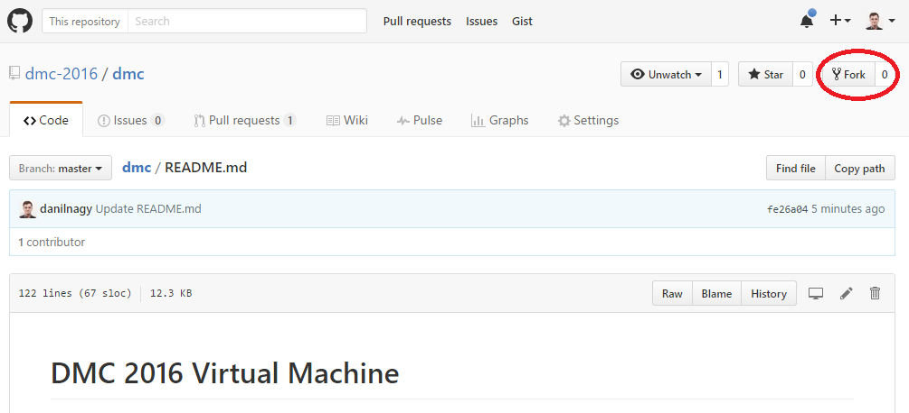

-

You should now see this repository under your account, as a fork of the main repository from dmc-2016.

-

-

Now, let's download and install the Github client, so you can clone the repository to your local computer and access the files locally. Go here: [https://desktop.github.com/](https://desktop.github.com/) to download the client and follow the instructions to install it. I will use the windows version, but it works in a similar way for both Mac and Linux.

Once you have the client installed, you should see a blank interface. Click the plus sign in the upper left corner, and go to Clone. This should produce a list of any projects you have started or forked. CLick on your fork of 'dmc', and click the check mark to clone this repository to your local computer. It will ask you where you want to clone the repository into. Select a folder such as 'Documents/GitHub'. 

-

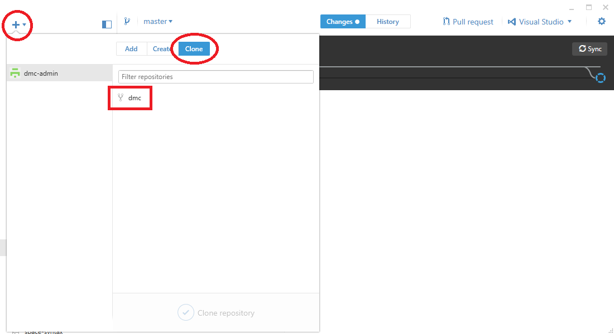

-

Once the process is complete, you will see a local copy of all the files from the repository in the specified folder and a blank interface telling you that you have not made any local changes. 

-

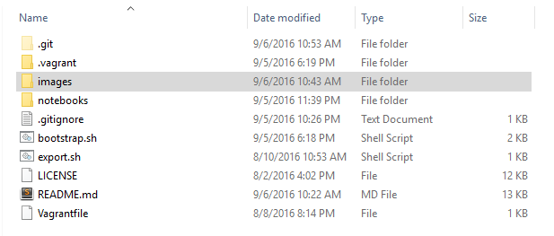

-

# Setting up the VM

Once you have a local copy of the dmc repository cloned to your computer, we will do the rest of the setup directly in code using the command line. 

You will follow these steps every time you want to work with the environment. Each time you boot up the VM it will check to make sure the VM is properly set up. Since this is our first time booting up, it will first install the new VM, and then provision it with all the software we will use in class. It will download all of the software automatically, so make sure you are connected to the internet. Depending on the speed of your connection, the initial setup and installation might take some time, so be patient, and whatever you do, do not close the command line window during installation.

To access the command line, open the Command Prompt if you are on Windows, or Terminal if you are on MacOSX, and navigate to the local folder where you cloned the repo by typing the following command:

    cd Documents/GitHub/dmc

but change the path depending on where you cloned the repo. To execute the command, type it in exactly as above and hit `Enter`. Now that we are in the proper directory, let's start the VM by typing in the command window:

    vagrant up

This will go through the initialization procedure and start up the VM. If this is the first time you are booting up, it will create a new VM in VirtualBox according to instructions in the `Vagrantfile` file, and then install all the software according to the instructions in the `bootstrap.sh` file. This can take some time, so wait until all the installation steps are complete before proceeding.

Once the setup is done you should have a new VM set up through VirtualBox which is provisioned with all the software we will use in class. To check that the VM was installed, you can open up the VirtualBox software. You should see your VM there with the status `Running`

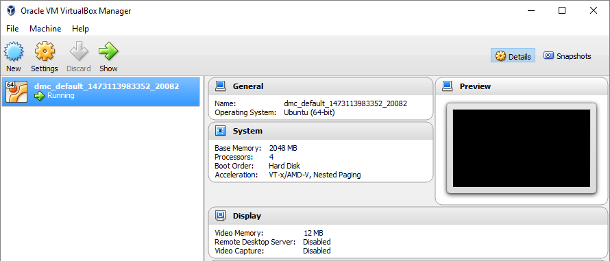

Now go back to your command line and type in:

    vagrant ssh

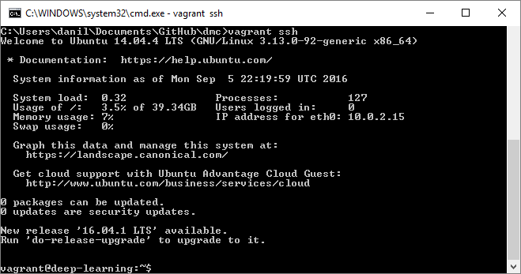

This will use SSH to give you remote access into your VM, so that all the commands you type will be executed on the new Linux machine. You can now work on this machine through the command line, but this might be difficult if you've never worked with a computer this way. Luckily, most of our work will be done through the Jupyter interactive coding interface which has a much friendlier user interface. All we have to do to launch the Jupyter interface is to execute the following command in the same command line window:

    bash /vagrant/notebooks/launch.sh

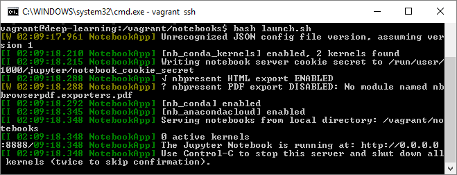

This will run a script that will launch the Jupyter server and forward it to your local computer. It will also share the 'notebooks' folder between the VM and your local machine, so that you can work with files directly on your local system. To see the notebooks, open a browser on your local machine, and browse to [http://127.0.0.1:8888](http://127.0.0.1:8888) or [localhost:8888](localhost:8888).

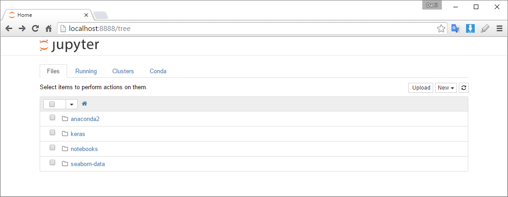

You should now see a folder structure which shows you all the files on your VM, including the notebooks folder which is synced back to your local machine. To test your setup, click on the 'notebooks' folder, and then the 'week-1' folder. Now open the notebook called 'week 1 - VM test.ipynb'.

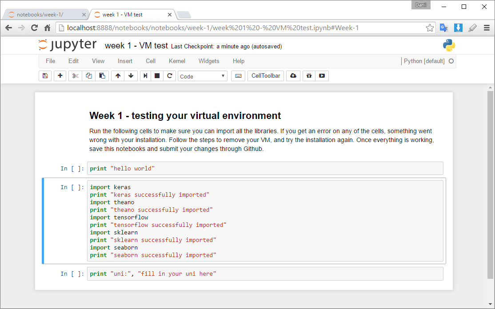

In the top menu, click on `Cell -> Run` All to make sure all the cells run without any errors. In the last cell, change the code to print out your uni and rerun the cell (you can hit Ctrl+Enter to run an individual cell). Once everything is working, you should save go to `File -> Save and Checkpoint` to save your changes and `File -> Close and Halt` to close the notebook.

When you are done working on the VM, go back to the Command Prompt or Terminal window from which you launched it. Then execute the following process to shut down the VM:

1. Ctrl+C twice to exit out of notebook server
2. Ctrl+D to exit out of SSH remote access
3. execute the command `vagrant halt` to shut down the VM. This will shut down the machine, but keep all the files so you can work on them at a later time.

Now, the next time you want to work on the VM, just follow the launching instructions again, starting with the command

    vagrant up

If you wish to completely erase your VM and start from scratch, you can also use the command

    vagrant destroy

which will completely erase the VM and all of it's files. This might be necessary if something goes wrong with the installation or you have problems importing any of the libraries. Although this will erase all local files stored on the VM, your notebooks and any changes you made should remain since that folder is synced to your local machine.

### Syncing your work and submitting assignments through Github

Once you are done working with the notebooks, you can sync your changes back to Github. This will create a backup of your works and allow you to see your work on the Github site. Most importantly, this will be the method for turning in your lab work each week. In general, each week during Session A will have a programming lab assignment contained in one or more notebooks in the appropriate folder. To complete the lab you should go through the notebook(s), execute the code, and add any additional code requested. Once you are done with the lab, you will 

1. save the notebook
2. sync the changes to your Github account
3. submit a pull request back to the main repository (dmc-2016/dmc), asking to merge all code. This pull request will serve as you 'handing in' the assignment, which will allow me to track everyone's work. Once I receive the pull request I will review your code, and possibly make comments and ask for revisions within the pull request comments section.

Let's test this workflow by syncing the changes we made to the week-1 notebook, and submit a pull request.

Whenever you make changes to any file within the repository folder, Github will register the change, and will track it in the Github Desktop program. You can review the changes made to each file by clicking them on the left pane. It will then show you which lines were deleted (in red) and added (in green) since the last commmit. To commit these changes to the repository, type in a short description of the changes you made, and hit the checkmark next to 'Commit to master'. To sync this commit to the online repository, hit the 'Sync' button in the top right corner. Anytime you want to make changes, make sure you both submit a commit **AND** sync to the server, or else no one else will be able to see your local changes.

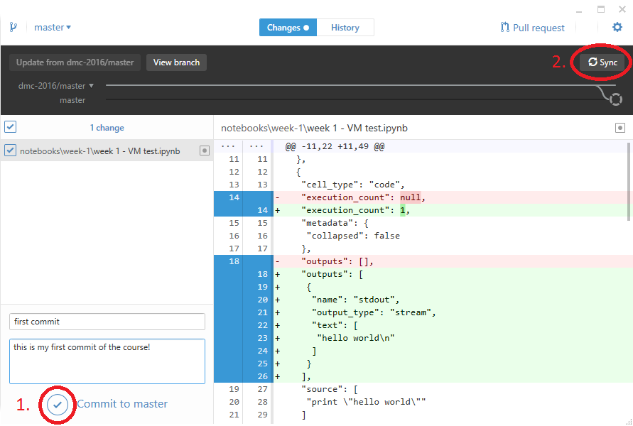

-

Once the changes are synced, you can go back to the Github website and see that the changes are now reflected in your fork, with the commit description written next to the changed file. 

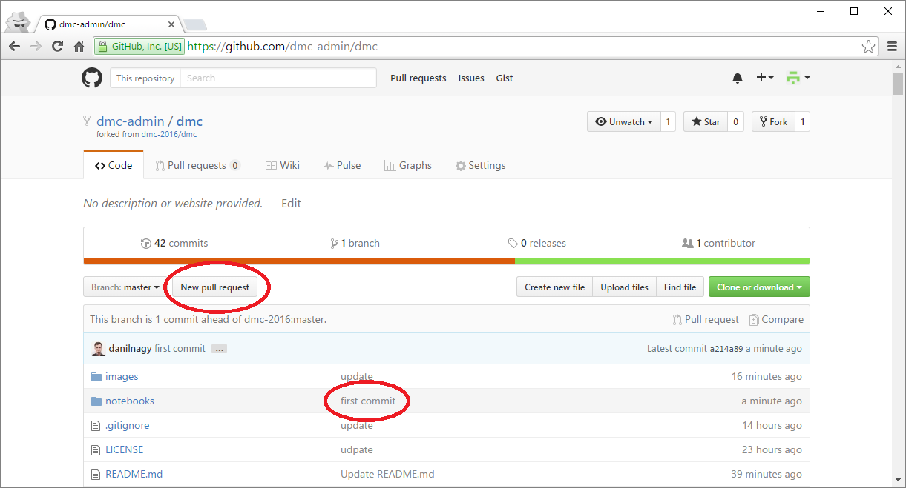

-

After you've made all the changes you want, you are now ready to submit your edits as a pull request to the master project. To start, click the text that says 'Pull request' (see image above). This will present you with an interface that lets you specify the source and target of the pull, as well as review the changes that have been made. On the top bar, the base fork should be the base project (`data-mining-the-city/getting-started`) and the head fork should be your fork (`<user>/getting-started`). In this case, since the changes are minor and are not in conflict with any changes made in the main project, it is able to merge the changes directly without any additional negotiations. 

Once you are satisfied, hit the green 'Create pull request' button to submit the request. You will have to write a short message describing all the changes you have made since forking the project. Make sure to write down any information the main project owners might need to know while considering your request. This will be the same method you use to turn in your lab work each week, so make sure to also include any feedback, as well as describe any issues or difficulties you had.

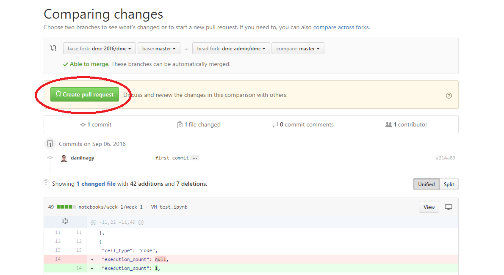

-

After the pull request has been made, you will be notified by email about the status of the request, as well as any comments that are made in the comments section. I will use the pull requests to track and grade the assignments, and will use the comments section to leave you feedback and request any changes.

### Pulling in changes from the main repository

I will continue to develop the lab assignments throughout the course of the semester, and might make changes depending on the pace of the class. Therefore, it is very important that before you start on any assignment you pull in any changes from the main project into your fork. Unfortunately this is not possible through the Github Desktop GUI, but can be easily done with a few lines in the Git Shell, which allows you to enter git commands directly. 

First, make sure there are not any uncommited changes in your repo (the left pane says 'No changes'). Next, open the Git Shell by clicking the setup icon in the top right corner, and select `Open in Git Shell`.

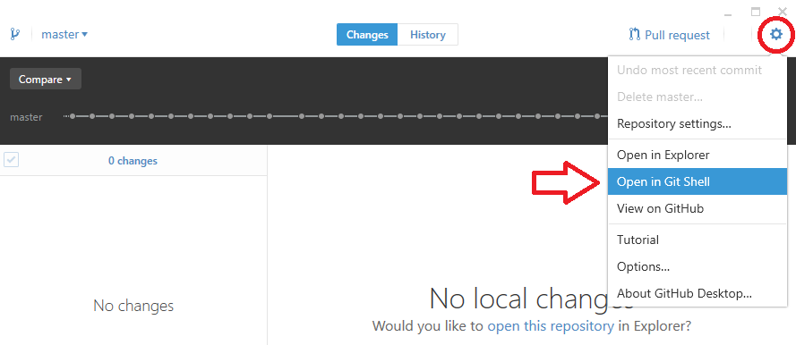

Now, type in the following commands to set the remote master repository, and pull in changes to your local fork:

    git remote add upstream https://github.com/dmc-2016/dmc.git

This commands assigns the original repo to a remote called "upstream"

    git fetch upstream

This commands pulls in changes from the original repo not present in your local repository, without modifying your files.

    git merge upstream/master

This commands merges fetched changes into your working files.

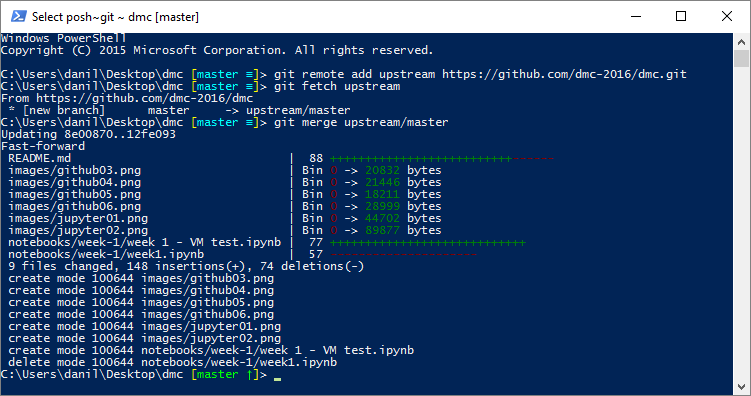

-

It should only be necessary to set the remote repository the first time. Next time you want to pull in changes from the master repository you can just open the Git Shell and type in 

    git fetch upstream
    git merge upstream/master

Make sure to do this before starting any assignment, and good luck!
